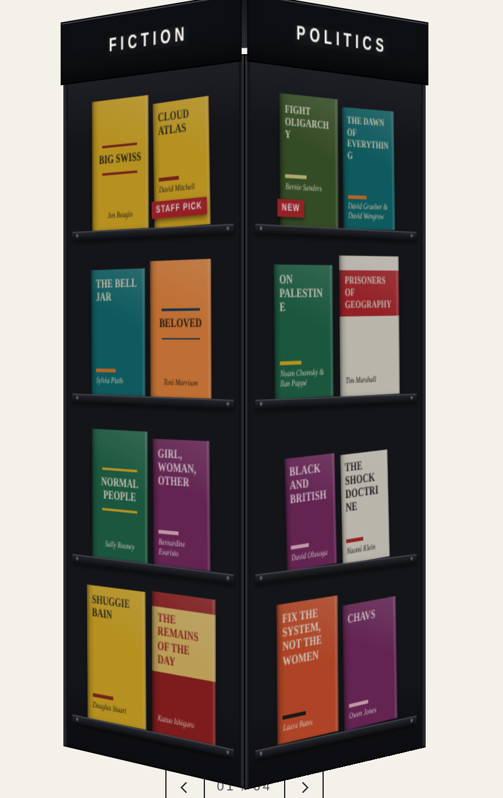

# `<spinner-rack>`

The wire spinner rack from the doorway of a good bookshop, built *into* a page
rather than imitated on top of one. Four facings of covers on a turning drum:
you push it and it keeps going.

There is no painted steel, no riveted shelf lip and no illuminated sign — that
treatment reads as a photograph of a shop fitting pasted onto a page, which is
the opposite of belonging to one. What's left is the part that was actually
worth having: the turn. Rows are separated by space alone, signs are set in
your own type, and a facing turning away fades into the page's own colour
rather than darkening like an object. Each facing gives up half of `--rack-gap`
at each edge, so the gap across a corner matches the gap within a row and the
whole drum reads as one grid. (`chrome="fixture"` puts the steel back if you want
it — see below.)



**Standalone.** This is not part of the Bermondsey Review site and is not bound
by the design direction in the repo's root `CLAUDE.md`. It imports nothing,
touches no global styles, and has no build step. Drop it into any shop front
end — plain HTML, Shopify/Liquid, WooCommerce, Next, whatever.

> **Integrating it into a shop?** `INTEGRATION.md` is the one-page version
> written for that: the markup contract, where the script and markup go, the
> data requirements and what to check. This file is the full reference.

> **Why is it like this?** `CLAUDE.md` in this directory carries the design
> decisions and the reasoning behind them, what was measured rather than
> guessed, the traps that cost time once already, and what is still open. Read
> it before changing anything here.

---

## Use it

```html
<script type="module" src="spinner-rack.js"></script>

<spinner-rack label="Picador" sides="4" per-shelf="2">
  <a href="/books/peterloo"
     data-title="Peterloo"
     data-author="Robert Poole"
     data-cover="/covers/peterloo.jpg"
     data-price="£10.99"
     data-category="History">Peterloo</a>
  <!-- …twenty-odd more… -->
</spinner-rack>
```

That's it. No init call, no config object.

### Why the books are plain `<a>` elements

Because with the script switched off — blocked, failed, still loading, or a
crawler looking — the custom element stays undefined, no shadow root is
attached, and the page renders a list of working product links. The rack is
pure enhancement on top of markup that already did the job. It also means your
stock stays indexable, which a JSON-fed carousel throws away.

Style the fallback if you like:

```css
spinner-rack:not(:defined) { display: block; }
spinner-rack:not(:defined) a { display: block; padding: 2px 0; }
```

### Or drive it from JavaScript

```js
document.querySelector('spinner-rack').books = [
  { title: 'Peterloo', author: 'Robert Poole', href: '/books/peterloo',
    cover: '/covers/peterloo.jpg', price: '£10.99', category: 'History' },
];
```

Setting `.books` re-renders and takes precedence over the light DOM. Handy in a
SPA, but you give up the no-JS fallback, so prefer the markup form where the
server can render it.

---

## Trying it with your own stock

Open **`try-standalone.html`** from your desktop. No server, no install,
nothing uploaded anywhere — it all stays in the tab.

> Use the **standalone** one. `try.html` loads the component as a module, and a
> module served from `file://` is blocked by CORS, so double-clicking *that*
> file gets you the no-JS fallback and no rack. `try-standalone.html` is the
> same page with the component inlined; regenerate it with `node build-try.mjs`
> after changing `spinner-rack.js`. Over a static server, either works.

1. **Paste your books**, straight out of a spreadsheet. **Keep the header row**
   and the columns can be in any order, under most of their usual names —
   `title`/`name`/`product`, `author`/`brand`, `link`/`url`/`product url`,
   `category`/`genre`/`collection`, `cover`/`image`/`thumbnail`, plus
   `review` and `source`. Columns it doesn't recognise are ignored, so a raw
   catalogue export with SKUs and prices in it works as-is. With no header row
   it falls back to reading them in that order. Only `title` is required. A
   spreadsheet field containing commas is fine — paste with tabs, or quote it.
   `category` names the panel a book lands on, so four categories fill four
   facings. It rebuilds as you type.
2. **Add covers, either way.** Put a URL in the `cover` column, or drag the
   image files onto the page. Filenames are matched to titles loosely, so
   `the-salt-path.jpg`, `The Salt Path.png` and `salt path 9780241.jpeg` all
   find the same book. It says how many matched and names what didn't, which is
   usually a filename that doesn't resemble the title. Dropped files win over
   URLs, on the grounds that you dropped them more recently.
3. **Copy the markup.** Once it looks right, take the `<spinner-rack>` block
   and paste it into your own template. Dropped covers come out as `data:`
   URLs, so swap those for your real image paths on the way through.

**If the shop is already live, you need none of this.** Your covers are on a
CDN with public URLs, so paste those into the `cover` column and the rack
loads them straight from there.

**Links only work as full `https://` addresses** in a file opened from disk —
a path like `/books/x` has nothing to resolve against. The harness counts them
and says so rather than letting you find out by tapping.

**`Phone width`** pens the rack into 390px. The rack ships to phones only, so
that is the shape worth judging; a desktop browser gives it a different one.

## Attributes

| Attribute | Default | What it does |
|---|---|---|
| `sides` | `4` | Panels round the rack, 3–8 |
| `per-shelf` | `2` | Books per shelf, 1–4 |
| `rows` | derived | Shelves per panel. Left alone, the rack is only as tall as the stock needs |
| `label` | — | Fallback crown text. Each panel otherwise shows its own `data-category`, drawn exactly as you wrote it — the rack never re-cases it, because lowercasing is blind to acronyms and imprint names ("UK History" would read "Uk history") |
| `snap` | off | `snap="true"` makes it catch a facing square-on instead of free-wheeling to a stop anywhere |
| `preview` | off | `preview="tap"` makes the first tap on a book open a shelf card with its review and a link through to the product |
| `pick-label` | `Guardian review` | What the marker under a reviewed book reads, where the book doesn't name its own source |
| `chrome` | none | `chrome="fixture"` draws it as a painted-steel shop fitting: riveted shelf lips, an illuminated sign, books casting shadows |

### How many titles

**Capacity is `sides × rows × per-shelf`,** and `rows` is capped at 7 so a big
feed can't produce a skyscraper. Anything past capacity isn't rendered — a
spinner is a browsing surface, not a catalogue.

**24 titles is the measured optimum** on a phone: at 245px of panel that gives
113×169 covers over three shelves. 32 needs a fourth shelf and squeezes the
panel to 190px for the same screen height; 16 leaves height unused. The table
behind that, and why height rather than width is the binding constraint, is in
`CLAUDE.md`.

Stock is dealt out balanced, so six books give you 2/2/1/1 rather than 4/2/0/0
and two bare panels.

## Book data

| Attribute | Required | Notes |
|---|---|---|
| `href` | yes | Where the book goes |
| `data-title` | yes | Falls back to the link text |
| `data-author` | | |
| `data-cover` | | Omit it and a typographic jacket is generated — see below |
| `data-price` | | Carried on the `rack-select` payload for the host to use. The rack never draws or announces it — see below |
| `data-category` | | First book on a panel names that panel's crown |
| `data-category-href` | | Where that category's sign links to — see below |
| `data-ar` | | Cover width ÷ height. Only needed for a title that differs from `--rack-cover-ratio` |
| `data-review` | | A short quote from a review. Its presence is what marks a book and gives it a card — see below |
| `data-source` | | Who reviewed it, e.g. `Observer`. Overrides `pick-label` for this book |

### Prices

The rack shows no prices — not on the shelf, not on the card, and not on the
`aria-label`. `data-price` is still read and still travels on the
`rack-select` payload, so a host that wants it can put it in its own furniture.
Reasoning in `CLAUDE.md`.

### The sign as a link

Give the books a `data-category-href` and each panel's sign becomes a link to
that category page:

```html
<a href="/the-salt-path/" data-title="The Salt Path" data-author="Raynor Winn"
   data-category="Nature" data-category-href="/collections/nature/">The Salt Path</a>
```

A rack holds a couple of dozen titles and is otherwise a dead end — spin, tap a
book, or leave. The sign already names the shelf, so linking it is the exit to
the rest of the catalogue without adding any furniture.

**It links itself only where the panel is genuinely one category.** The sign
takes its text from the first book, which is true on a feed grouped by category
and a lie on an interleaved one. A wrong label is cosmetic; a wrong link walks a
customer to the wrong page. So a panel whose books disagree renders its sign as
plain text, exactly as before, and you don't have to police your feed for it.

No underline and no accent colour — a small chevron carries the affordance, and
the tap target is 44px, taller than the glyphs, growing up into headroom the
crown already reserves.

### Cover proportions

Every book takes `--rack-cover-ratio`, which defaults to **0.6667 — standard
hardback, 156 × 234 mm, exactly 2:3.** A feed that serves covers at one uniform
size therefore comes out as a clean grid with nothing to configure. Paperback
lists want `0.649` (B-format) or `0.636` (A-format).

The default is written to four places deliberately: it's what the measuring
pass reports for a 2:3 image, so a generated jacket and a real cover land on
the same box to the pixel rather than differing by a hair.

A book whose cover genuinely differs is still handled. The ratio is measured
off the image as it loads, so a landscape photo book sits shorter in its column
rather than being cropped to a detail of itself; pass `data-ar` (width ÷
height) to skip the reflow when you already know. Anything outside 0.4–1.7 is
treated as a broken asset and clamped rather than allowed to wreck the shelf.

One thing to watch if your covers are normalised to a fixed canvas: whatever
padding that leaves around the jacket is part of the image, so a white-padded
canvas shelves as a white-bordered book against the dark rack. Transparent
padding, or a canvas matched to `--rack-metal`, avoids it.

### Missing cover images

Shops always have a few — a pre-order with no artwork yet, a backlist reissue
nobody scanned. An empty grey box in a rack of colour reads as broken, so
books without `data-cover` get a generated jacket instead. So do books whose
cover URL fails to load — a 404, a CDN hiccup, a path typo — because a missing
cover and a broken one should look the same to a customer.

A jacket is one of twelve ink/paper pairs and one of three layouts, picked by a
hash of the title, so a given book always looks the same. The type is sized to the longest word in the
title by measuring the actual font on a canvas, so nothing comes out as
`OLIGARC / HY`.

---

## Events

```js
rack.addEventListener('rack-select', (e) => {
  e.preventDefault();               // cancel navigation, open a quick-view
  openQuickView(e.detail.book);     // {book, index, face, element}
});

rack.addEventListener('rack-face', (e) => {
  analytics.track('rack_panel_seen', e.detail);   // {face, label}
});
```

`rack-select` is cancelable. Leave it alone and the link navigates as normal.

## Methods and properties

```js
rack.goToFace(2);     // turn to panel 2, smoothly
rack.spin(900);       // give it a shove — decelerates like a flick
rack.books = [...];   // set the stock instead of using light-DOM children

rack.angle;           // how far round it is, in degrees — live
rack.angle = -45;     // put it there at once, stopping whatever it was doing
```

`angle` is the real state, read straight off the physics. Don't use the
`--angle` custom property for either job — it is written only at rest and the
drum's transform overrides it, so setting it moves nothing (`CLAUDE.md`).

---

## Styling

Set custom properties on the element:

```css
spinner-rack {
  --rack-cover-ratio: 0.6667;    /* standard hardback (2:3) */
  --rack-rule: rgba(0,0,0,0.16); /* hairline round each cover */
  --rack-page: #f4f1ea;          /* YOUR page colour — facings fade into it */
  --rack-accent: #b8262b;        /* focus rings */
  --rack-max-width: 220px;      /* panel width; the rack sweeps ~1.41× this */
  --rack-book-font: Georgia, serif;                           /* generated jackets */
  --rack-crown-font: Georgia, serif;                          /* the sign */
}
```

Web fonts loaded in the host page apply inside the shadow root, so
`--rack-book-font: "Your Grotesk"` works with no extra plumbing.

`--rack-page` is the one you must set: it is what a facing fades into as it
turns away, so it has to be your actual page background. The default is
`Canvas`, which is only a guess.

**`--rack-max-height` (default `80vh`)** is what keeps it usable on a phone.
Covers divide the panel, so a narrow screen doesn't make the rack narrower — it
makes it *taller*, and a rack you can only see two shelves of is a rack you
can't browse. The layout pass measures what it laid out and scales the panel
down until the element fits, dropping a shelf if that isn't enough. Set it to
`none` to let the rack run to whatever height its stock needs.

**Width.** A four-sided rack sweeps a circle about 1.41× the panel width, so
give it that much room or it clips as it turns. `--rack-max-width` is the dial
for how big the covers get when there's height to spare.

### `chrome="fixture"`

The original treatment, kept because it works: steel panels, riveted shelf
lips, an illuminated sign, books with drop shadows leaning slightly in their
pockets. It needs `--rack-metal`, `--rack-crown` and `--rack-crown-ink`, and it
wants a dark ground to sit on.

---

## The shelf card

`preview="tap"` gives a card to each book carrying a `data-review`. The first
tap opens the card instead of navigating; the card carries the real product
link, so the buy path survives the extra step. Books with no note tap straight
through and carry no marker.

A reviewed book is marked under its cover — "Guardian review" in the accent
colour, out of flow so a marked book is exactly as tall as a plain one.

**The wording is data, not a constant.** A shop quotes whoever reviewed the
book, so `data-source` on a book names its own paper and `pick-label` sets the
rack's default for books that don't. The card repeats the attribution under the
quote.

**The card belongs to the facing, not the page.** It sits in the facing's plane,
turns with it and fades with it, anchored to whichever half of the facing the
tapped book *isn't* in. Dismissed by the close button, Escape, tapping another
book, grabbing the rack, or turning away. A press that starts *inside* the card
is the reader using it, so it neither turns the rack nor closes the card.

Where a pointer exists, hover previews the card too, after 150ms so sweeping
across the rack doesn't strobe.

> The demo's notes are placeholder copy attributed to real papers. Swap them
> before this goes anywhere public. Rationale for the marker's form, and the
> version of it that was tried and rejected, are in `CLAUDE.md`.

## Weight

| | raw | gzipped |
|---|---|---|
| source, as shipped (~22% comments) | 73 KB | 24.8 KB |
| minified (esbuild) | 36 KB | **13 KB** |

Zero dependencies, no build step. Less than any one of the sample cover images.

Cumulative layout shift is 0, the script is deferred so it doesn't block
rendering, nothing runs while the rack is untouched, and all 239 nodes sit
inside the shadow root — so the host page's DOM is untouched and neither
stylesheet can reach the other.

**The covers cost far more than the script**, and `loading="lazy"` does not
defer the facings turned away. If the rack sits below the fold, gate its render
on an `IntersectionObserver`. Measurements and cover-sizing advice in
`CLAUDE.md`.

## Content-Security-Policy

Works under a strict policy — `style-src 'self'` with no `unsafe-inline` —
because nothing it needs arrives as inline style. The stylesheet is built with
`new CSSStyleSheet()` and handed over through `adoptedStyleSheets`; per-element
numbers ride as `data-*` and are applied with `el.style.setProperty()` after
insertion. Verified on a host page carrying no inline style or script of its
own: zero violations, correct geometry, turns normally.

Where constructable stylesheets are missing (Safari before 16.4) it falls back
to a `<style>` element, which a strict policy will refuse.

## On mobile

- **`--rack-max-height` resolves through `dvh`** where supported. On iOS `vh`
  means the viewport with the URL bar hidden, so a `vh` budget can be taller
  than what is actually on screen — the exact failure the budget exists to
  prevent.
- **Hover is behind `@media (hover: hover)`.** Left unguarded, `:hover` sticks
  after a tap and the book you last touched stays dimmed.
- **Controls are 44px**, a thumb target rather than a cursor target.
- **A half-screen thumb swipe coasts about 1.4 facings** at the default
  gearing, because the free-wheel inertia carries it well past where your
  finger let go. A slow drag with no flick in it turns about 54° for 200px and
  stops there, mid-corner — which is what free-wheeling means.

### Landscape

A phone turned sideways has half the height, and a four-sided drum's height
follows its panel width — so the spare width is only reachable by putting **more
books on fewer shelves.** The rack picks its own shape to suit:

| | Shape | Cover | Books shown |
|---|---|---|---|
| 390 × 844, portrait | 3 × 2 | 112 × 168 | 24 of 24 |
| 844 × 390, landscape | **1 × 4** | **100 × 150** | 16 of 24 |
| 844 × 280 | 1 × 2 | 87 × 130 | 8 of 24 |

One wide shelf of four, rather than two shelves of two — same sixteen books,
covers half again as big. **It costs books**, so `rack.shape` reports what
happened (`{rows, perShelf, sides, capacity, rendered, dropped, reshaped}`) and
a host that minds can say "16 of 24" rather than quietly showing two thirds.

Rotating out and back returns the portrait shape exactly, and rotating into a
viewport gives the same answer as loading in it. Set `rows` and `per-shelf`
explicitly to opt out of the search.

`--rack-max-height` is measured against **the element**, not the turning drum
inside it: the crown sits above the drum, and a strip below reserves the
perspective overhang. If you check this yourself, measure the host.

## Accessibility

- **No buttons, no counter.** Swiping is the gesture, the one-time nudge
  advertises it, and the facing's own heading says which one you are looking
  at — a counter only repeated that. Nothing about keyboard or screen-reader
  access depended on them.
- **Keyboard:** the rack is a focus stop; ← → turn one panel, Home returns to
  the front, and Tab walks the books on the panel facing you. Panels round the
  back are `inert`, so focus never disappears behind the rack — except for a
  panel that currently holds focus, which stays reachable while it turns.
- **Screen readers:** the panel and its category are announced through a live
  region on every turn. Each book is a real link labelled with its title and
  author — the same information the shelf shows, and nothing it doesn't.
- **`prefers-reduced-motion`:** no inertia, no attention nudge; turns are
  instant. It's still a rack, it just doesn't spin.
- **Pointer:** `touch-action: pan-y`, so a vertical swipe scrolls the page and
  only a horizontal one turns the rack. A drag that moved the rack swallows the
  click, so you never open a book you were only spinning past.
- **Clicks stay native.** Drags are tracked on the window rather than with
  `setPointerCapture`, so the browser keeps the click entirely — middle-click
  and cmd/ctrl-click to open in a new tab keep working. (`CLAUDE.md` explains
  why capture breaks it.)

## BigCommerce + Searchspring

The light-DOM form maps straight onto a Stencil template, which is the case it
was designed for; Searchspring is the opposite shape and goes through the
`books` property. Use both: server-render a default set, then upgrade it.

### Where to put it

Three routes. The choice is about **where the book list comes from**, not about
whether the rack works — it works in all three.

| | Page Builder HTML widget | Script Manager + widget | Theme file |
|---|---|---|---|
| Book list | hand-written in the widget | hand-written in the widget | Handlebars, from the catalogue |
| Stays current on its own | no | no | **yes** |
| Crawlable links | yes | yes | yes |
| Survives a theme update | yes | yes | only if you carry the change |
| Needs Stencil CLI | no | no | yes |
| Merchandiser can move it | **yes** | **yes** | no |

**For a curated shelf, Page Builder is the right answer** — whoever picks the
books can place and edit the rack too, with no CLI and no theme deploy. **For a
shelf that populates itself** ("New in", always current) you need the Handlebars
loop, and that needs a template. That is the only thing Page Builder cannot do.

**Recommended shape.** Host the script once and let the widget hold only markup,
so it doesn't matter whether the widget server-renders or injects:

1. Upload `spinner-rack.js` over WebDAV into the store's `content/` folder
   (Settings → File access). Files there serve from the storefront root with the
   `/content` prefix dropped, so it becomes `/spinner-rack.js`.
2. One line in Script Manager, footer, all pages:
   ```html
   <script type="module" src="/spinner-rack.js"></script>
   ```
3. The HTML widget holds the rack and nothing else:
   ```html
   <spinner-rack label="Staff picks" sides="4" per-shelf="2" preview="tap">
     <a href="/the-salt-path/" data-title="The Salt Path" data-author="Raynor Winn"
        data-category="Nature" data-cover="/product_images/salt-path.jpg">The Salt Path</a>
     <!-- …the rest of the shelf… -->
   </spinner-rack>
   ```

That gives one file to update when the component changes, instead of re-pasting
35 KB of minified JavaScript into a widget. An inline `<script>` inside the
widget works too, but only if the widget server-renders — `CLAUDE.md` has the
four arrangements measured and why this one avoids the question.

For the theme-file route, reference the asset the normal Stencil way so it gets
the CDN and cache busting:

```handlebars
<script type="module" src="{{cdn 'assets/js/spinner-rack.js'}}"></script>
```

### The markup

The light-DOM form maps straight onto a Stencil template — this is the case it
was designed for:

```handlebars
<spinner-rack label="{{category.name}}" sides="4" per-shelf="2" preview="tap">
  {{#each category.products}}
    <a href="{{url}}"
       data-title="{{name}}"
       data-author="{{brand.name}}"
       data-cover="{{getImageSrcset image 1x='320w'}}"
       data-price="{{price.without_tax.formatted}}"
       data-category="{{../category.name}}">{{name}}</a>
  {{/each}}
</spinner-rack>
```

`data-review` and `data-source` have no native home in the catalogue. Either
put them in a product custom field and read `{{#each custom_fields}}`, or hold
the notes in the template — there are only ever a handful.

### Covers: ask for a width, not a box

`getImageSrcset` takes size descriptors of the form `640w` or `2x`, and with
exactly **one** descriptor it returns a single URL rather than a srcset — which
is what `data-cover` wants. (`getImage image 'product_size'` also works, but it
resolves the name against the theme's `config.json` and clamps to
`Math.min(image.width, requested)`, so what you get depends on theme settings
you may not control.)

Ask for a **width only**. A width-only descriptor preserves the source's own
aspect ratio, so you know what you are getting. Whether a `WxH` request fits
inside that box or pads to fill it is not something the public docs state
plainly, and it decides whether the grid stays uniform — so don't rely on it.

Sizing follows from the measurement in *Weight*: covers render at about
119 × 179 CSS px, so **238w covers a 2× screen and 320w covers 2.7×**. A stock
600 × 900 product image is 6.3× more pixels than needed at 2×; at twenty-four
covers that is the difference between roughly 1–2 MB and 400–600 KB.

If your covers are already uniform 2:3 — most publisher artwork is — the grid
comes out uniform on its own. Where ratios vary, the rack measures each cover
and shelves it correctly anyway; you just lose the even grid rather than
breaking anything.

### Searchspring on top

Searchspring is the opposite shape: recommendations arrive as JSON from a
client-side call, so they go through the `books` property.

**Use both.** Server-render a default set into the light DOM and replace it when
Searchspring answers:

```js
customElements.whenDefined('spinner-rack').then(async () => {
  const rack = document.querySelector('spinner-rack');   // already painted, already crawlable
  const res = await fetch(recommendationsUrl);           // siteId + profile tag
  const [profile] = await res.json();                    // one entry per requested profile

  rack.books = profile.results.slice(0, 24).map((p) => ({
    href:   p.mappings.core.url,
    title:  p.mappings.core.name,
    author: p.mappings.core.brand,
    cover:  p.mappings.core.thumbnailImageUrl,
    price:  p.mappings.core.price,
    category: 'Recommended for you',
  }));
});
```

`mappings.core` carries `sku`, `name`, `url` and `thumbnailImageUrl`; the rest
depends on how your profile is mapped, so check yours rather than trusting the
field names above.

The `whenDefined` wrapper matters — see *Framework notes*. Assigning `.books`
before the module has loaded used to write an own property that shadowed the
accessor permanently, so the first assignment worked and every one after it
silently did nothing. The component recovers from that now, but waiting is the
cleaner shape and this is exactly the code path that hit it.

### Four things to get right

- **Ask for the same number of titles you server-rendered.** Setting `books`
  re-renders, and a different count can change the shelf count, so the rack
  visibly re-lays out under the reader.
- **All the covers load up front.** `loading="lazy"` does not defer the facings
  turned away — they are rotated out of view but still inside the viewport. If
  the rack is below the fold, gate its render on an `IntersectionObserver`.
- **Check your CSP if you have one.** The rack is clean under
  `style-src 'self'` (see *Content-Security-Policy*), but a Stencil theme that
  sets one will also need to allow whatever else you are injecting.
- **`thumbnailImageUrl` is a thumbnail.** At 238–320px wide a 200px thumbnail
  will look soft. Take the width off the product image rather than the
  thumbnail field if Searchspring gives you both.

### What to check yourself

The helper signatures above come from the `paper-handlebars` source. The image
fit-versus-pad question and the Searchspring response shape could not be
verified from the machine this was written on — see `CLAUDE.md`. Settle the
image one against your own catalogue in a minute: request the same image at
`238w` and at `238x358` and compare the pixel dimensions you get back.

## Framework notes

**React** — custom elements work, but `books` is a property, not an attribute:

```jsx
const ref = useRef(null);
useEffect(() => { ref.current.books = books; }, [books]);
useEffect(() => {
  const el = ref.current;
  const onSelect = (e) => { e.preventDefault(); setQuickView(e.detail.book); };
  el.addEventListener('rack-select', onSelect);
  return () => el.removeEventListener('rack-select', onSelect);
}, []);
return <spinner-rack ref={ref} label="Picador" />;
```

Better still, render the `<a>` children from your product data as JSX and let
the rack read them — then it server-renders and you keep the fallback.

**Next.js** — `import 'spinner-rack.js'` inside a `'use client'` component, or
`<Script type="module" src="/spinner-rack.js" />`. The element upgrades
whenever the module lands; markup rendered before then is the fallback list,
which is the point.

**Shopify** — loop a collection into the `<a>` children in Liquid and load the
script with `defer`.

---

### Assigning `.books` before the module loads

Wait for the definition, or the first assignment will appear to work and every
one after it will silently do nothing:

```js
customElements.whenDefined('spinner-rack').then(() => { el.books = data; });
```

The component recovers from it either way. Why it happens is in `CLAUDE.md`.

## How the turning works

Constants live in `PHYSICS` at the top of the file.

**It's real 3D, not a slide carousel.** N flat panels turned on a drum inside
`preserve-3d`. The far side is genuinely hidden, panels foreshorten as they
turn, and the corner is a real corner — none of which is reproducible by
translating slides sideways.

**It free-wheels by default,** coasting to a stop wherever it runs out, like the
real fixture — including at rest on a corner, showing two half-facings.

**`snap="true"` adds a detent that only bites once the rack has slowed** — like
the ball-catch in a real rack's base. Above `FREE_SPIN` (300°/s) a facing has no
grip at all, so a hard flick free-wheels through several turns before anything
catches; below it the pull ramps in and lands the rack square.

Release velocity is measured over ~60ms rather than the last frame, so one
stuttered frame as you let go doesn't decide how far it travels.

Two subtleties here are load-bearing: why each facing must stay
`transform-style: flat`, and why nothing in the frame path may write a custom
property. Both are in `CLAUDE.md`, and changing either without reading it will
cost you an afternoon.

---

## Testing

`demo.html` is a working integration example — open it over any static server:

```sh
npx http-server -p 8899 .
```

It covers the light-DOM form, the no-JS fallback, and a cancelled `rack-select`
wired to a quick-view. `try-standalone.html` is the harness for putting a real
catalogue through it with no server at all — see above for why it's the
standalone and not `try.html`.

`host-page.html` is the rack dropped onto a retail product page — brand bar,
serif headings on white, a conventional chevron carousel directly above it and a
pill CTA below — for judging it against the conventions it has to live beside.
The seven values in its `:root` are the whole theme; point them at a real set of
brand tokens and both the page and the rack follow.

The behavioural suites, what each one guards, and the discipline they're held to
are in `CLAUDE.md`.
